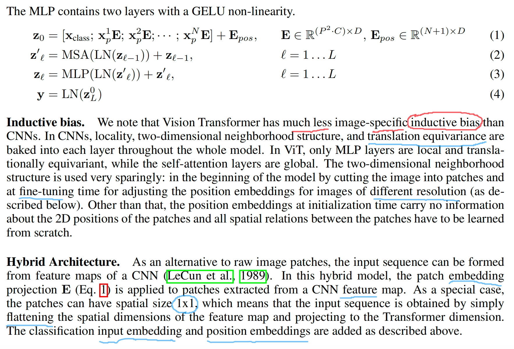
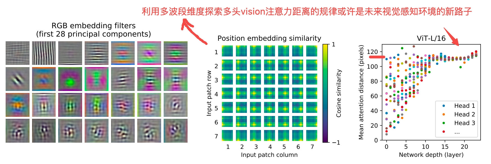

## 2020
### Vision Transformer 2020

* Paper: "[An Image is Worth 16x16 Words: Transformers for Image Recognition at Scale](https://arxiv.org/abs/2010.11929)"
* Authors: Alexey Dosovitskiy, Lucas Beyer, Alexander Kolesnikov, Dirk Weissenborn, Xiaohua Zhai, Thomas Unterthiner, Mostafa Dehghani, Matthias Minderer, Georg Heigold, Sylvain Gelly, Jakob Uszkoreit, Neil Houlsby

作者使用完全摒弃CNN卷积提取特征的方式，采用纯Transformer直接sequences of image patches来执行进行图片分类任务。
1. 将图片切割成 sequence of linear embeddings 的补丁patches，平坦线性展开
2. **Image patches are treated the same way as tokens (words)** in an NLP application. We train the model on image classification in supervised fashion.
3. Transformers lack some of **the inductive biases inherent** to CNNs, such as **translation equivariance and locality**, and therefore do not **generalize** well
when trained on insufficient amounts of data.
4. The classification head is implemented by **a MLP with one hidden layer** at pre-training time and by <u>a single **linear layer** at fine-tuning time</u>.
5. MLP: Typically consists of two fully connected layers with a GELU (Gaussian Error Linear Unit) **non-linearity** in between.

6. Self-attention allows ViT to <u>**integrate information** across the entire image</u> even in the lowest layers. We investigate to <u>what degree the network makes use of this capability</u>. 
Specifically, we compute the average distance in image space across which information is integrated, based on the attention weights. This “**attention distance**” is analogous to receptive field size in CNNs.
Further, the attention distance increases with network depth. Globally, we find that the model attends to image regions that are semantically relevant for classification. 他想表达的是利用vision transformer进行分类会抓住属于图像中相关的“图像语义”，类似text中的文字语义。
7. Transformers show impressive performance on NLP tasks. However, much of their success stems not only from their **excellent scalability** but also from large scale **self-supervised** pre-training.
8. Using multi-band dimension to explore the distribution law of vision attention distance with the number of multi-head may be a new way of visual perception environment in the future.

## 2019
### EfficientNet

* Paper: "[EfficientNet: Rethinking Model Scaling for Convolutional Neural Networks](https://arxiv.org/abs/1905.11946)"
* Authors: Mingxing Tan, Quoc V. Le

## 2018
### BERT 2018

* Paper: "[BERT: Pre-training of Deep Bidirectional Transformers for Language Understanding](https://arxiv.org/abs/1810.04805)"
* Authors: Jacob Devlin, Ming-Wei Chang, Kenton Lee, Kristina Toutanova

### GPT 2018

* Paper: "Improving Language Understanding by Generative Pre-Training"
* Authors: Alec Radford, Karthik Narasimhan, Tim Salimans, Ilya Sutskever
### ELMo 2018

* Paper: "[Deep contextualized word representations](https://arxiv.org/abs/1802.05365)"
* Authors: Matthew E. Peters, Mark Neumann, Mohit Iyyer, Matt Gardner, Christopher Clark, Kenton Lee, Luke Zettlemoyer

## 2017
### Transformer 2017

* Paper: "[Attention Is All You Need](https://arxiv.org/abs/1706.03762)"
* Authors: Ashish Vaswani, Noam Shazeer, Niki Parmar, Jakob Uszkoreit, Llion Jones, Aidan N. Gomez, Lukasz Kaiser, Illia Polosukhin
### Capsule Network 2017

* Paper: "[Dynamic Routing Between Capsules](https://arxiv.org/abs/1710.09829)"
* Authors: Sara Sabour, Geoffrey E. Hinton, Nicholas Frosst
### MobileNets 2017

* Paper: "[MobileNets: Efficient Convolutional Neural Networks for Mobile Vision Applications](https://arxiv.org/abs/1704.04861)"
* Authors: Andrew G. Howard, Menglong Zhu, Bo Chen, Dmitry Kalenichenko, Weijun Wang, Tobias Weyand, Marco Andreetto, Hartwig Adam

## 2017
### DenseNet 2017

* Paper: "[Densely Connected Convolutional Networks](https://arxiv.org/abs/1608.06993)"
* Authors: Gao Huang, Zhuang Liu, Laurens van der Maaten, Kilian Q. Weinberger

## 2016
### SqueezeNet 2016

* Paper: "[SqueezeNet: AlexNet-level accuracy with 50x fewer parameters and \<0.5MB model size](https://arxiv.org/abs/1602.07360)"
* Authors: Forrest N. Iandola, Song Han, Matthew W. Moskewicz, Khalid Ashraf, William J. Dally, Kurt Keutzer

### AlphaGo 2016

* Paper: "[Mastering the game of Go with deep neural networks and tree search](https://www.nature.com/articles/nature16961)"
* Authors: David Silver, Aja Huang, Chris J. Maddison, Arthur Guez, Laurent Sifre, George Van Den Driessche, Julian Schrittwieser, Ioannis Antonoglou, Veda Panneershelvam, Marc Lanctot, Sander Dieleman, Dominik Grewe, John Nham, Nal Kalchbrenner, Ilya Sutskever, Timothy Lillicrap, Madeleine Leach, Koray Kavukcuoglu, Thore Graepel, Demis Hassabis

## 2015
### ResNet (Residual Networks) 2015

* Paper: "[Deep Residual Learning for Image Recognition](https://doi.org/10.48550/arXiv.1512.03385)"
* Authors: Kaiming He, Xiangyu Zhang, Shaoqing Ren, Jian Sun

### U-Net 2015

* Paper: "[U-Net: Convolutional Networks for Biomedical Image Segmentation](https://arxiv.org/abs/1505.04597)"
* Authors: Olaf Ronneberger, Philipp Fischer, Thomas Brox
### YOLO (You Only Look Once) 2015

* Paper: "[You Only Look Once: Unified, Real-Time Object Detection](https://arxiv.org/abs/1506.02640)"
* Authors: Joseph Redmon, Santosh Divvala, Ross Girshick, Ali Farhadi
### Diffusion Model 2015

* Paper: "[Deep Unsupervised Learning using Nonequilibrium Thermodynamics](https://arxiv.org/abs/1503.03585)"
* Authors: Jascha Sohl-Dickstein, Eric A. Weiss, Niru Maheswaranathan, Surya Ganguli

## 2014
### VGG 2014

* Paper: "[Very Deep Convolutional Networks for Large-Scale Image Recognition](https://arxiv.org/abs/1409.1556)"
* Authors: Karen Simonyan, Andrew Zisserman

### Inception Network (GoogLeNet) 2014

* Paper: "[Going Deeper with Convolutions](https://arxiv.org/abs/1409.4842)"
* Authors: Christian Szegedy, Wei Liu, Yangqing Jia, Pierre Sermanet, Scott Reed, Dragomir Anguelov, Dumitru Erhan, Vincent Vanhoucke, Andrew Rabinovich

### R-CNN 2014

* Paper: "[Rich feature hierarchies for accurate object detection and semantic segmentation](https://arxiv.org/abs/1311.2524)"
* Authors: Ross Girshick, Jeff Donahue, Trevor Darrell, Jitendra Malik
### GAN (Generative Adversarial Networks) 2014

* Paper: "[Generative Adversarial Nets](https://arxiv.org/abs/1406.2661)"
* Authors: Ian J. Goodfellow, Jean Pouget-Abadie, Mehdi Mirza, Bing Xu, David Warde-Farley, Sherjil Ozair, Aaron Courville, Yoshua Bengio

## 2012
### AlexNet 2012

* Paper: "ImageNet Classification with Deep Convolutional Neural Networks"
* Authors: Alex Krizhevsky, Ilya Sutskever, Geoffrey E. Hinton

## 1998
### LeNet5 1998

* Paper: "Gradient-Based Learning Applied to Document Recognition"
* Authors: Yann LeCun, Léon Bottou, Yoshua Bengio, Patrick Haffner